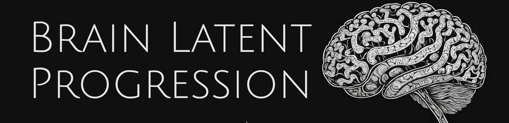
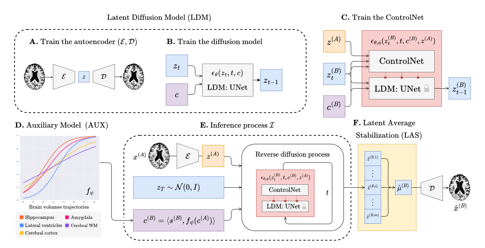

<h4 align="center">Enhancing Spatiotemporal Disease Progression Models via Latent Diffusion and Prior Knowledge</h4>

<h4 align="center"><a href="https://lemuelpuglisi.github.io/">Lemuel Puglisi</a>, <a href="https://profiles.ucl.ac.uk/3589">Daniel C. Alexander</a>, <a href="https://daniravi.wixsite.com/researchblog">Daniele Ravì</a></h4>

<p align="center">
  <a href='https://papers.miccai.org/miccai-2024/paper/0511_paper.pdf'>
    
  </a>
  <a href='https://youtu.be/6YKz2MNM4jg?si=nkG21K4lIgLrH-pK'>
    
  </a>
</p>

<p align="center">
  <a href="#installation">Installation</a> •
  <a href="#training">Training</a> •
  <a href="#inference">CLI Application</a> •
  <a href="#citing">Cite</a>
</p>

https://github.com/anon4access/BrLP/assets/121947111/303e0fc7-d617-41af-b60e-e218fd64d608

**NEWS**

* 🆕 The [short guide on using the BrLP CLI](https://lemuelpuglisi.github.io/blog/2024/brlp/) is out!
* 🎉 BrLP has been nominated and shortlisted for the MICCAI Best Paper Award! (top <1%)
* 🎉 BrLP has been early-accepted and selected for **oral presentation** at [MICCAI 2024](https://conferences.miccai.org/2024/en/) (top 4%)!


## Table of Contents
- [Installation](#installation)
- [Data preparation](./REPR-DATA.md)
- [Training](#training)
- [Pretrained models](#pretrained-models)
- [Acknowledgements](#acknowledgements)
- [Citing our work](#citing)

## Installation

Download the repository, `cd` into the project folder and install the `brlp` package:

```console
pip install -e .
```
We recommend using a separate environment (see [Anaconda](https://www.anaconda.com/)). The code has been tested using python 3.9, however we expect it to work also with newer versions.

## Data preparation

Check out our document on [*Data preparation and study reproducibility*](./REPR-DATA.md). This file will guide you in organizing your data and creating the required CSV files to run the training pipelines.


## Training



Training BrLP has 3 main phases that will be discribed in the subsequent sections. Every training (except for the auxiliary model) can be monitored using `tensorboard` as follows:

```console
tensorboard --logdir runs
```


### Train the autoencoder

Follow the commands below to train the autoencoder.

```console
# Create an output and a cache directory
mkdir ae_output ae_cache

# Run the training script
python scripts/training/train_autoencoder.py \
  --dataset_csv /path/to/A.csv \
  --cache_dir   ./ae_cache \
  --output_dir  ./ae_output
```

Then extract the latents from your MRI data:

```console
python scripts/prepare/extract_latents.py \
  --dataset_csv /path/to/A.csv \
  --aekl_ckpt   ae_output/autoencoder-ep-XXX.pth
```

Replace `XXX` to select the autoencoder checkpoints of your choice.

### Train the UNet

Follow the commands below to train the diffusion UNet. Replace `XXX` to select the autoencoder checkpoints of your choice.


```console
# Create an output and a cache directory:
mkdir unet_output unet_cache

# Run the training script
python scripts/training/train_diffusion_unet.py \
  --dataset_csv /path/to/A.csv \
  --cache_dir   unet_cache \
  --output_dir  unet_output \
  --aekl_ckpt   ae_output/autoencoder-ep-XXX.pth
```

### Train the ControlNet

Follow the commands below to train the ControlNet. Replace `XXX` to select the autoencoder and UNet checkpoints of your choice.

```console
# Create an output and a cache directory:
mkdir cnet_output cnet_cache

# Run the training script
python scripts/training/train_controlnet.py \
  --dataset_csv /path/to/B.csv \
  --cache_dir   unet_cache \
  --output_dir  unet_output \
  --aekl_ckpt   ae_output/autoencoder-ep-XXX.pth \
  --diff_ckpt   unet_output/unet-ep-XXX.pth
```

### Auxiliary models

Follow the commands below to train the DCM auxiliary model.

```console
# Create an output directory
mkdir aux_output

# Run the training script
python scripts/training/train_aux.py \
  --dataset_csv /path/to/A.csv \
  --output_path aux_output
```

We emphasize that any disease progression model capable of predicting volumetric changes over time is also viable as an auxiliary model for BrLP.

## Inference

Our package comes with a `brlp` command to use BrLP for inference. Check:
```console
brlp --help
```

The `--input` parameter requires a CSV file where you list all available data for your subjects. For an example, check to `examples/input.example.csv`. If you haven't segmented your input scans, `brlp` can perform this task for you using [SynthSeg](https://surfer.nmr.mgh.harvard.edu/fswiki/SynthSeg), but it requires that FreeSurfer >= 7.4 be installed. The `--confs` parameter specifies the paths to the models and other inference parameters, such as LAS $m$. For an example, check `examples/confs.example.yaml`. 

Running the program looks like this:


## Pretrained models

Download the pre-trained models for BrLP:

| Model                  | Weights URL                                                  |
| ---------------------- | ------------------------------------------------------------ |
| Autoencoder            | [link](https://studentiunict-my.sharepoint.com/:u:/g/personal/pgllml99h18c351e_studium_unict_it/EUxUFIQtkQ1EvBqojYA5BAYByIyHbttca5Mx1cU4bC6q3A?e=sCXSUA) |
| Diffusion Model UNet   | [link](https://studentiunict-my.sharepoint.com/:u:/g/personal/pgllml99h18c351e_studium_unict_it/EQT7KJTtfmRAguf8_utWeJIBUJPsRRgPZlt94s2vNbwVFw?e=IjHnx7) |
| ControlNet             | [link](https://studentiunict-my.sharepoint.com/:u:/g/personal/pgllml99h18c351e_studium_unict_it/EYtVvH47dFJJnH8gtwSMA-MB8c3pm4_Z9g5F_IG1OKxW9Q?e=CzvGT4) |
| Auxiliary Models (DCM) | [link](https://studentiunict-my.sharepoint.com/:u:/g/personal/pgllml99h18c351e_studium_unict_it/EXJDQqLNCwBFkt2J6zg1kpwBS_1hAZoBfGy5AfcGOBZvHQ?e=Z05kOG) |

## Acknowledgements

We thank the maintainers of open-source libraries for their contributions to accelerating the research process, with a special mention of [MONAI](https://monai.io/) and its [GenerativeModels](https://github.com/Project-MONAI/GenerativeModels/tree/main) extension.

## Citing

MICCAI 2024 proceedings:

```bib
@inproceedings{puglisi2024enhancing,
  title={Enhancing spatiotemporal disease progression models via latent diffusion and prior knowledge},
  author={Puglisi, Lemuel and Alexander, Daniel C and Rav{\`\i}, Daniele},
  booktitle={International Conference on Medical Image Computing and Computer-Assisted Intervention},
  pages={173--183},
  year={2024},
  organization={Springer}
}
```

Arxiv Preprint:

```bib
@article{puglisi2024enhancing,
  title={Enhancing Spatiotemporal Disease Progression Models via Latent Diffusion and Prior Knowledge},
  author={Puglisi, Lemuel and Alexander, Daniel C and Rav{\`\i}, Daniele},
  journal={arXiv preprint arXiv:2405.03328},
  year={2024}
}
```


